<div align="center">

  <!-- Project badge -->
  <a href=".">
    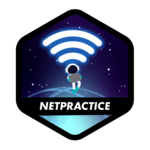
  </a>

  <!-- Project name -->
  <h1>NetPractice</h1>

  <!-- Short description -->
  <p>Discover the basics of networking.</p>

  <!-- Info badges -->
  <!--  -->
  

  <i>This project has been created as part of the 42 curriculum by <a href="#-authors">sede-san</a>.</i>

</div>

---

## ℹ️ About Project

> The goal of this project is to learn the basics of computer networking by configuring small-scale networks. To do so, it is necessary to understand how IP addresses work.

**NetPractice** is a general practical exercise that introduces the fundamentals of computer networking. It consists of **10 levels**, each presenting a broken network diagram that must be repaired by configuring the correct IP addresses, subnet masks, and routing rules. The goal is to develop a solid understanding of how devices communicate across networks, including the roles of routers, switches, and gateways, by solving real-world-style networking problems in a simulated environment.

For detailed info, refer to this project [subject](docs/en.subject.pdf).

## 📝 Instructions

1. Download the project archive from the project page and extract it into a folder of your choice.
2. Inside that folder, run the launch script:
   ```bash
   bash run.sh
   ```
   This starts a local web server and opens the NetPractice interface in your browser automatically.
  > [!WARNING]  
  > If `run.sh` does not work, start the server manually and navigate to it:
  >```bash
  >python3 -m http.server 49242
  ># then open http://localhost:49242 in your browser
  >```
3. On the welcome page, enter your **42 intranet login** in the field provided and click **Start**. This is required so that the exported files are tied to your personal configuration.
4. Use the **Training** tab to practice all 10 levels at your own pace. Alternatively, you can use the **Evaluation** tab to generate a random configuration, also suitable for evaluations.

> [!NOTE]  
> Due to license limitations, the project archive is only accessible through the intranet and, therefore, it is not accesible through this repository.

## 📚 Resources

- [MDN — How does the Internet work?](https://developer.mozilla.org/en-US/docs/Learn/Common_questions/Web_mechanics/How_does_the_Internet_work)
- [What Is An IP Address? How Does It Work?](https://www.fortinet.com/resources/cyberglossary/what-is-ip-address)
- [Wikipedia — Classless Inter-Domain Routing (CIDR)](https://en.wikipedia.org/wiki/Classless_Inter-Domain_Routing)
- [Wikipedia — OSI model](https://en.wikipedia.org/wiki/OSI_model)
- [Wikipedia - TCP/IP model](https://en.wikipedia.org/wiki/Internet_protocol_suite)
- [Subnet calculator](https://www.calculator.net/ip-subnet-calculator.html)

##  Solutions

This repository 

### Level 1

<details>
  <summary><b><i>Show</i></b></summary>
  <div align="center"><a href="level1.json">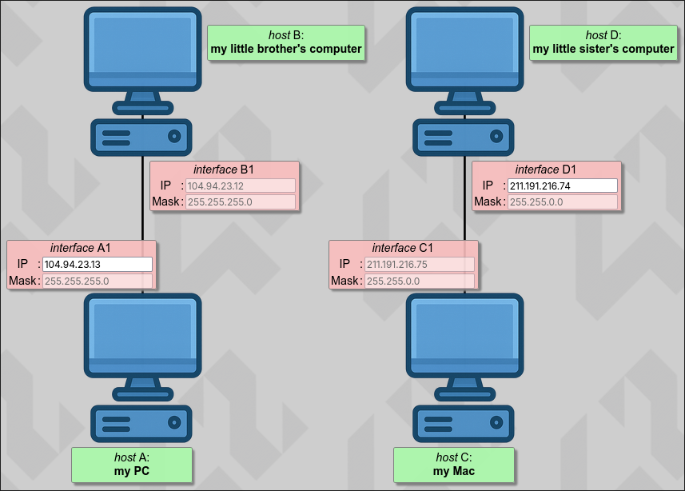</a></div>
</details>

### Level 2

<details>
  <summary><b><i>Show</i></b></summary>
  <div align="center"><a href="level2.json">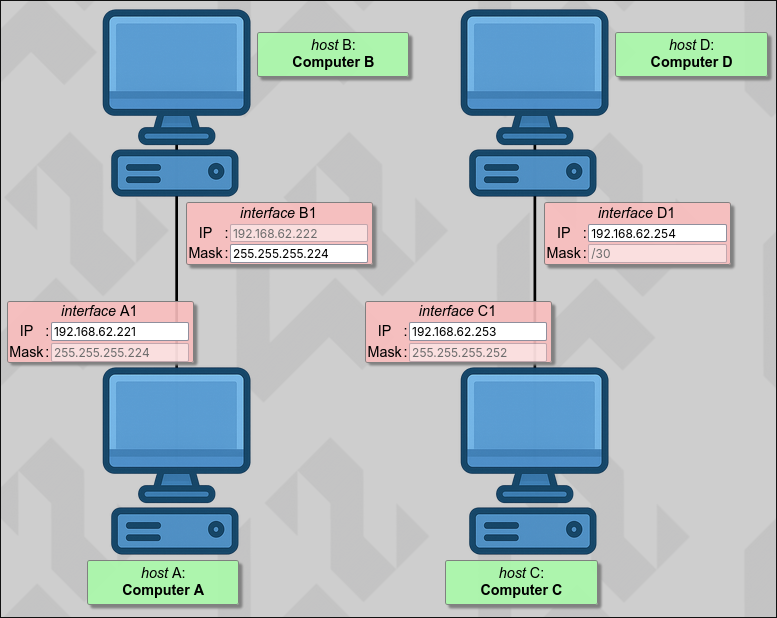</a></div>
</details>

### Level 3

<details>
  <summary><b><i>Show</i></b></summary>
  <div align="center"><a href="level3.json">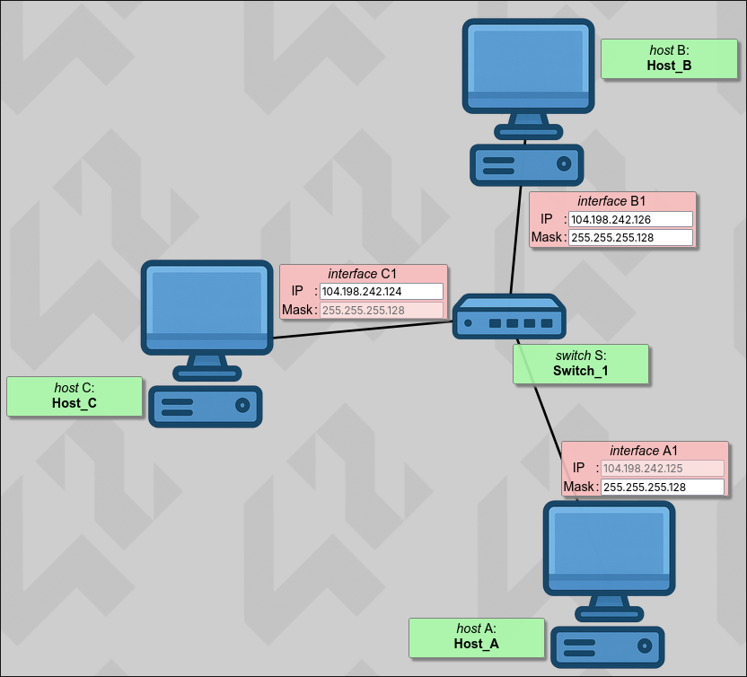</a></div>
</details>

### Level 4

<details>
  <summary><b><i>Show</i></b></summary>
  <div align="center"><a href="level4.json">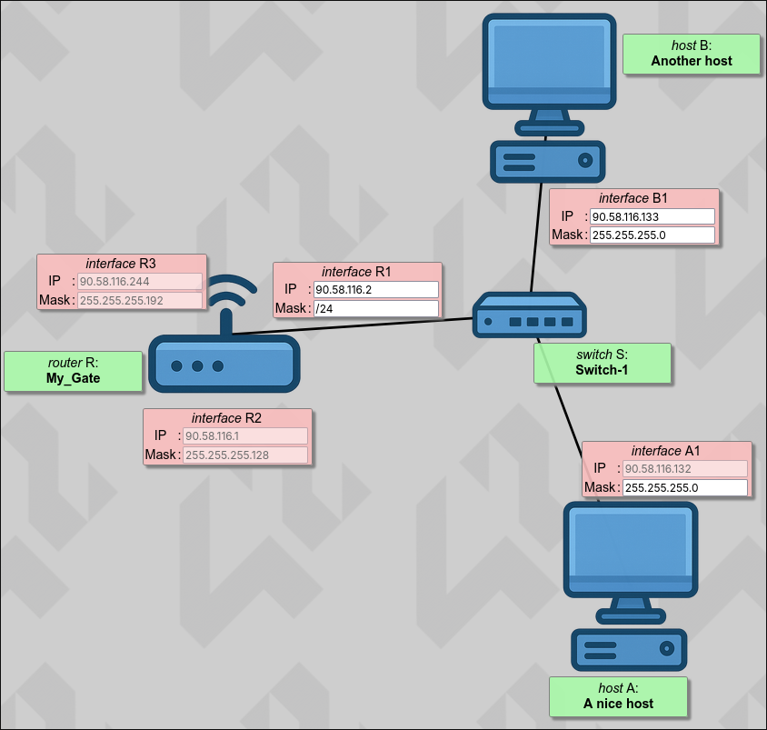</a></div>
</details>

### Level 5

<details>
  <summary><b><i>Show</i></b></summary>
  <div align="center"><a href="level5.json">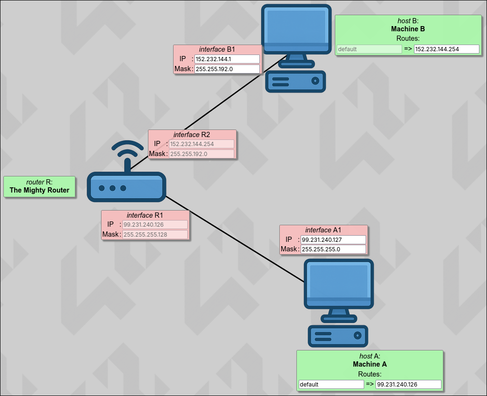</a></div>
</details>

### Level 6

<details>
  <summary><b><i>Show</i></b></summary>
  <div align="center"><a href="level6.json">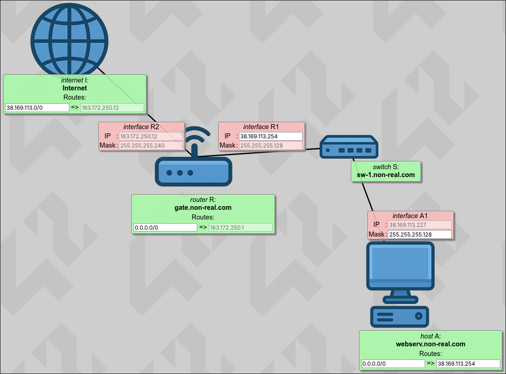</a></div>
</details>

### Level 7

<details>
  <summary><b><i>Show</i></b></summary>
  <div align="center"><a href="level7.json">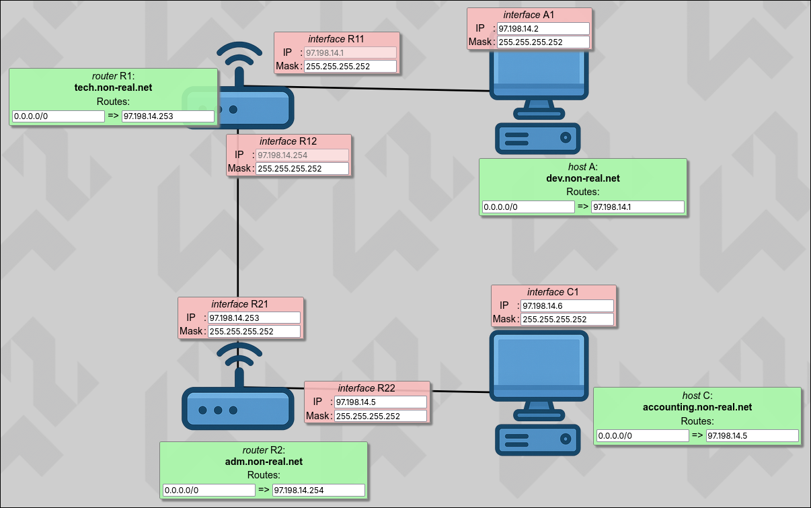</a></div>
</details>

### Level 8

<details>
  <summary><b><i>Show</i></b></summary>
  <div align="center"><a href="level8.json">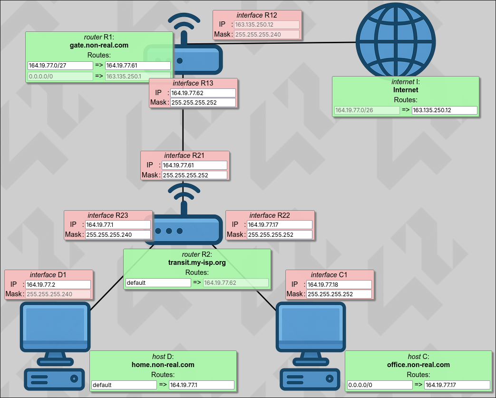</a></div>
</details>

### Level 9

<details>
  <summary><b><i>Show</i></b></summary>
  <div align="center"><a href="level9.json">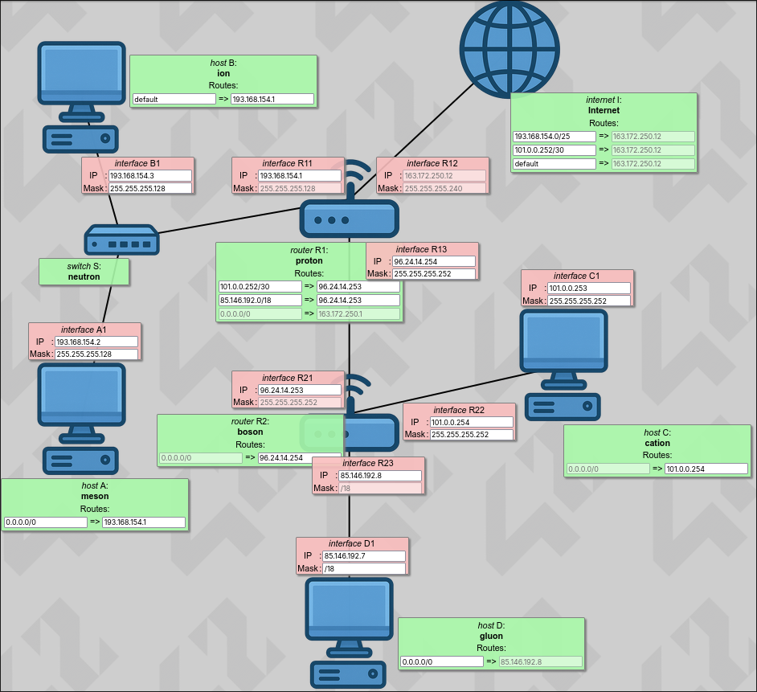</a></div>
</details>

### Level 10

<details>
  <summary><b><i>Show</i></b></summary>
  <div align="center"><a href="level10.json">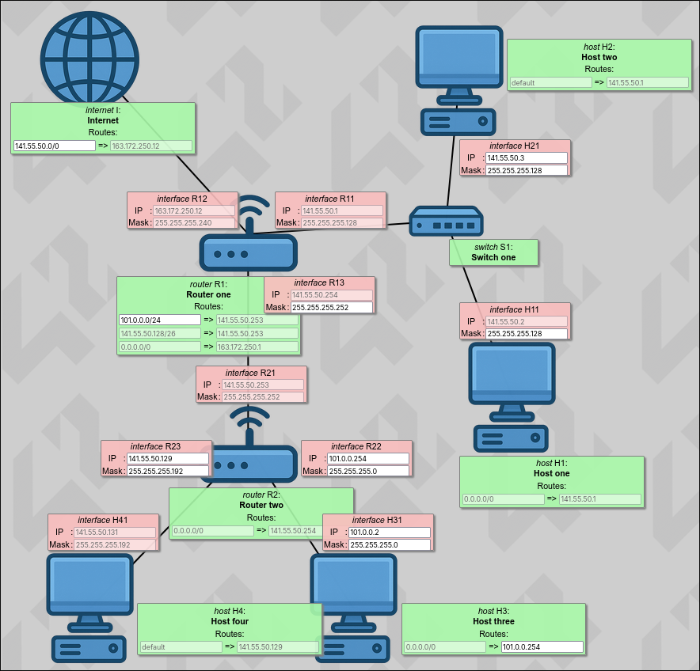</a></div>
</details>

## 🧑‍💻 Authors

<div align="center">

<a href="https://github.com/oakoudad/badge42"></a>

</div>

## 🙇‍♂️ Special thanks

- [lrcouto](https://github.com/lrcouto) and [ayogun](https://github.com/ayogun) for creating and publishing, respectively, the [42-project-badges](https://github.com/ayogun/42-project-badges) repository.
- [gcamerli](https://github.com/gcamerli) for creating the [42unlicense](https://github.com/gcamerli/42unlicense) repository.
- [oakoudad](https://github.com/oakoudad) for creating the [badge42](https://github.com/oakoudad/badge42) repository.

## ⚖️ License

<div align="center">

<a href="./LICENSE">

</a>

</div>

**This work is published under the terms of [42 Unlicense](LICENSE).** This means you are free to use, modify, and share this software.
